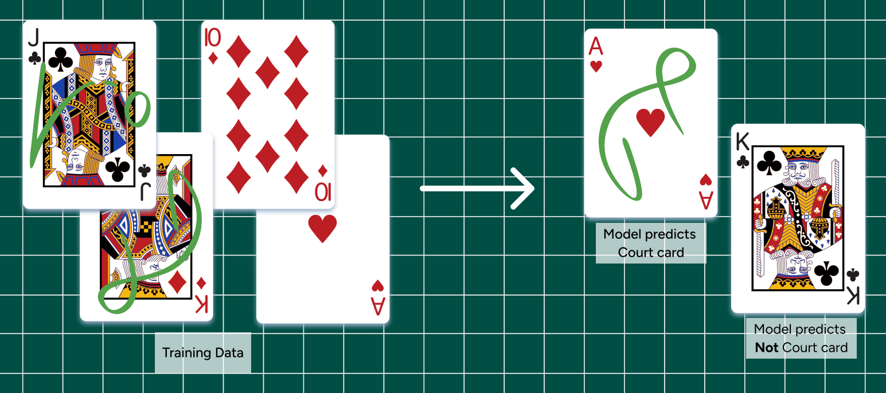

# Shortcut Learning is a Calibration Problem

<p align="center">
  
</p>

Code repository supporting the paper "Shortcut Learning is a Calibration Problem" 

**Mohamed Amine Kina, Eike Petersen**

paper link : [insert link here]


## Installation

1. Clone the repository:
```bash
git clone https://github.com/Amineki6/calibration-code.git
cd calibration-code
```

2. Create a virtual environment and install the required dependencies:
```bash
pip install -r requirements.txt
```

## Project Structure

- `train.py`: The main entry point for running training, Optuna sweeps, and final evaluations.
- `config/`: Directory containing YAML configuration files (e.g., `default.yaml`).
- `args.py` / `config.py`: Centralized configuration loading using `omegaconf`.
- `dataset.py` / `lightning_datamodule.py`: Handling of data loading, caching, and batching.
- `model.py` / `lightning_module.py`: PyTorch Lightning model definitions and backbone integrations.
- `methods/`: Directory containing all shortcut mitigation algorithms (e.g., `cdan.py`, `mmd.py`, `jtt.py`).
- `calibration/`: Directory containing all scripts for groupwise recalibration and reliability evaluation.
- `extract_features.py`: Script to extract and cache foundation model features.

## Implemented Methods

You can select a shortcut mitigation algorithm by setting the `method` configuration parameter (e.g., `method=supcon`). Supported methods include:
- `standard`: Standard Empirical Risk Minimization (ERM)
- `supcon`: Supervised Contrastive Learning
- `mmd`: Conditional Maximum Mean Discrepancy
- `cdan`: Conditional Domain Adversarial Networks (CDAN+E)
- `score_matching` & `dataset_score_matching`: Conditional Score Matching (CSM) objectives
- `soft_equalized_odds`: Soft Equalized Odds penalty
- `jtt`: Just Train Twice

## Usage

### Basic Training

To run a standard baseline with no hyperparameter optimization (using default config parameters):

```bash
python train.py \
    method=standard \
    backbone=densenet \
    data_dir=/path/to/data \
    csv_dir=/path/to/csv \
    epochs=50 \
    batch_size=64
```

### Hyperparameter Optimization

The framework is highly optimized for running Optuna trials to find the best mitigation hyperparameters. You can specify the number of trials and the evaluation metric for model selection. 

```bash
python train.py \
    --n_trials 50 \
    method=score_matching \
    backbone=medsiglip \
    select_chkpt_on=fairness \
    use_cached_features=true
```
*Tip: When using foundation models, pass `use_cached_features=true` to load pre-extracted features instead of running images through the heavy backbone. Make sure you run the `extract_features.py` script first.*

### Recalibration

Post-hoc recalibration of trained models, utilizing **groupwise beta calibration**. This technique (Prevalence-aware calibration) adjusts the model's predicted probabilities across different subpopulation groups to mitigate shortcut learning.

You can run batch evaluation of your final checkpoints before and after recalibration using `calibration/eval_recalibrated_runs.py`:

```bash
python calibration/eval_recalibrated_runs.py \
    --base-path /path/to/runs_directory \
    --runs run_1 run_2 \
    --data-dir /path/to/data \
    --beta-params abm
```

**Key Arguments:**
- `--base-path`: The root directory where your run outputs are stored.
- `--runs`: Specific run directory names to evaluate. You can alternatively provide a text file using `--runs-file`.
- `--calibration-val-csv`: Provide an explicit validation CSV file used for fitting the beta calibrators. If omitted, it defaults to the checkpoint's validation split.

## Configuration

Default hyperparameters and training parameters are managed in `config.py` using `ExperimentConfig`. You can override most of these from the command line.

For example, to manually override method-specific hyperparams instead of using Optuna:
```bash
python train.py method=mmd mmd_lambda=2.5 epochs=50
```

## Logging and Tracking

The project natively integrates with **Weights & Biases (W&B)**. 
- If you prefer to disable W&B tracking entirely, simply pass the `--no_wandb` flag to your `train.py` command.
- A comprehensive `optuna_training.log` is also generated automatically inside the output directory.
